# Cambodia and a bit of Myanmar

Welcome! This is my final project is mainly on Cambodia, but there are a few images on Myanmar. I selected Myanmar as my LMIC, but the country is quite large and my computer was not strong enough to process all the data. I switched to Cambodia after the first project.

## Administrative Subdivisions of Myanmar

Myanmar (formerly Burma) is a South-eastern Asian country bordering Bangladesh, India, China, Laos, and Thailand, with the Indian Ocean situated to the south. Myanmar is a relatively populous country with considerable area, which has 53,582,855 million people living in an area of 676,578 km^2, according to a 2017 national census. 

There are 14 regions in Myanmar, and 63 districts. The capital, Nay Pyi Taw, lies in the center of the country at the Naypyidaw Union Territory.
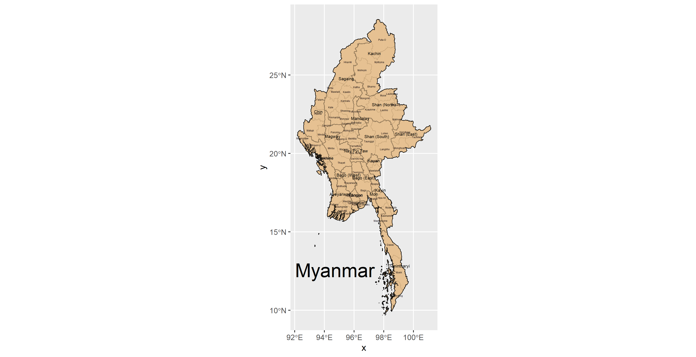

## Population of Myanmar’s Counties

As illustrated in the bar graph, Yangun is the most populous region in Myanmar. However, there are quite a few other regions in Myanmar that are also decently populated, sharing an equal and sizable chunk of the population. Myanmar in general has many people living in high densities all over the country, although there is a slight trend for the population to gravitate towards rivers and away from mountains. 
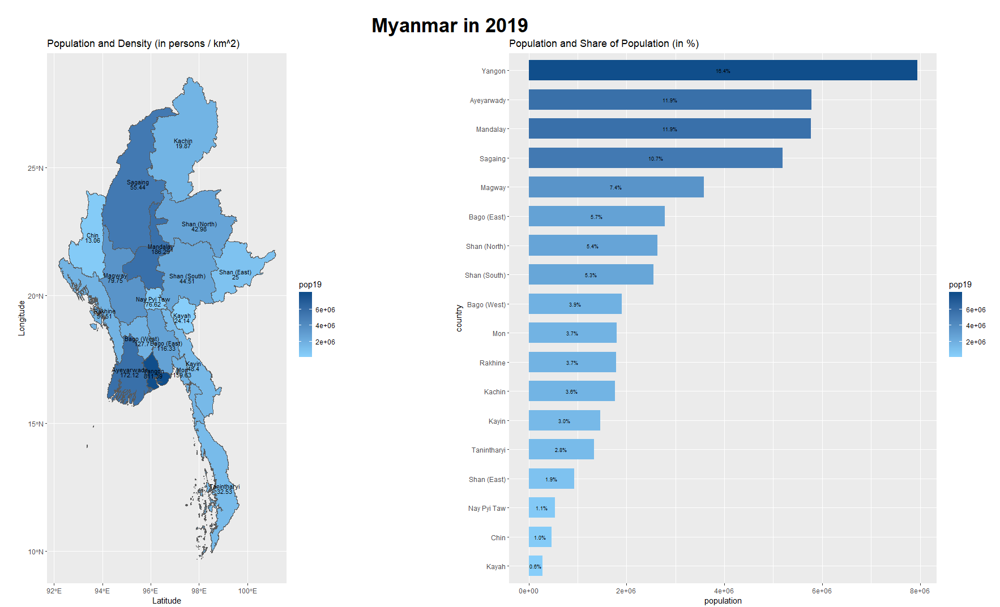

Below is a 3d plot of Myanmar, and the higher elavation the district is, the more populated it is. As you can see, Myanmar tends to be generally well populated all around. 

## Transition

Starting the second project however was when I switched countries. This was due to a computational power limitation as Myanmar really was quite big with 53 million people. I still wanted to choose a Southeast Asian LMIC, so after some research I opted for Cambodia. Cambodia was interesting to me mainly because of its involvement in the Vietnam war, which left the country off in a bad shape still lingering to this day.

## Administrative Subdivisions of Cambodia

Since I changed to Cambodia on project 2, I do not have the logpog and bar plots of the populations of the administrative subdivisions of Cambodia. However, I did go back and generate the boundaries of the subdivisions as seen below. There are a incredibly high density of divisions around the capital of Cambodia, Phnom Penh, in the lower middle part of the nation. Cambodia has a population of 15,288,489 people with an area of 181,035 km^2, which is quite smaller in both aspects compared to Myanmar, and thus allowed for my computer to better process the information. 
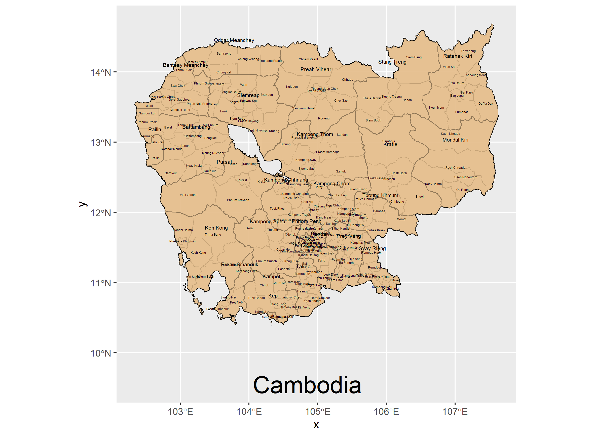

## Cambodia Population and Settlements

In the following best fit line plot of the relation between settlements in Cambodia and various other natural factors like bushes and rivers, it can be seen that a good amount of points (settlements in Cambodia like cities and small districts) do not align with the best fit line. This supports to conclusion that while people do tend to gravitate towards rivers, lights, and other factors, the general population can be found evenly spread across the entire country, with people living everywhere. 
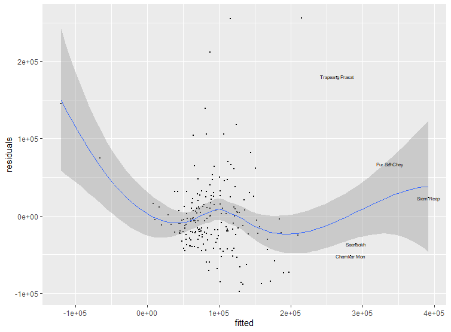

The best predictor of the population was the difference of sums. When looking at the summary of the sum variable, the Adjusted R-Squared value and the Multiple R-squared value both were the highest, at .5821 and .6077 respectively. For the summary of means, the values were .2308 and .2778 respectively, and for summary of logpop15, the values were .4351 and .4697 respectively. 

Population: Predictor-Sums
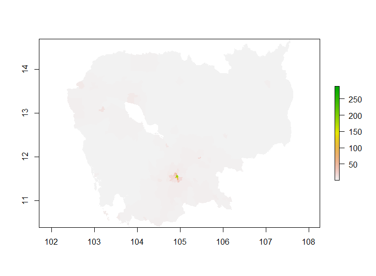

Difference: Predictor - Sums
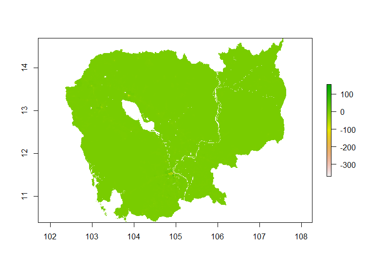

3d difference: Predictor - Sums
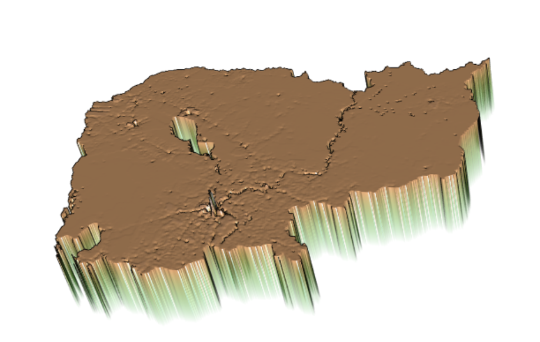

Summary of population with respect to variables dst011, dst040, dst130, etc. 
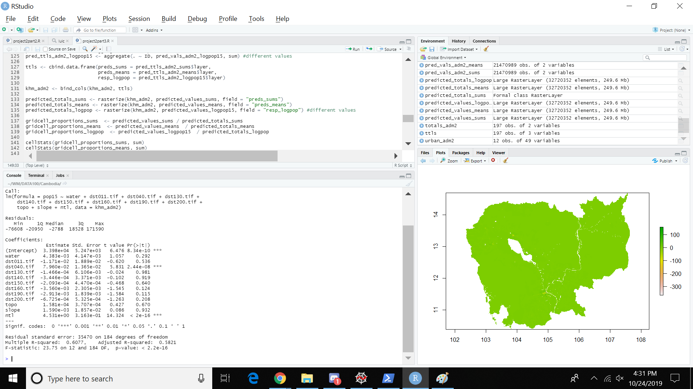

## Analysis

When taking Cambodia as a whole, it seems like the general population is evenly spread and does not move around much. However, as seen in the Difference: Predictor - Sums graph there are some spots like the capital Phnom Penh and large city Siem Reap that seem to have a degree of difference to it, which may stem from the homeless problem in Cambodia. 

## Siem Reap and Phnom Penh

Phnom Penh is the capital of Cambodia, and Siem Reap is another large, well visited tourist attraction place. They both have high population densities with respect to other cities in Cambodia, and thus I chose these two to analyze the population densities. 

### Phnom Penh
As seen in the population difference graph, the outskirts around the main capital area seem to have the largest variance in population, and this is likely due to the impoverished and homeless citizens residing in the capital who might be interfering with the population census. 

Population Difference in Penh:
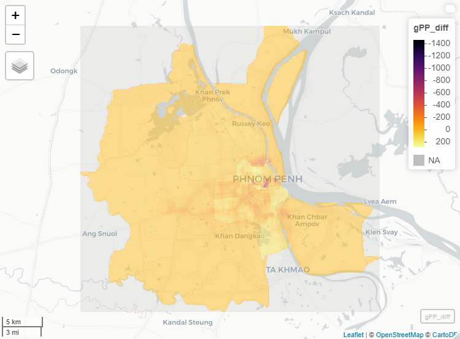

Population in Penh:
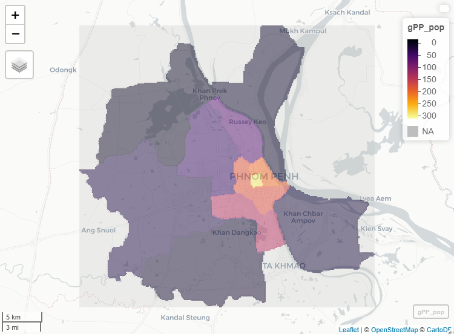

### Siem Reap
The same thing can be seen happening in the plots with Siem Reap. 
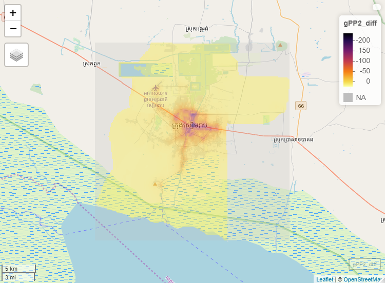
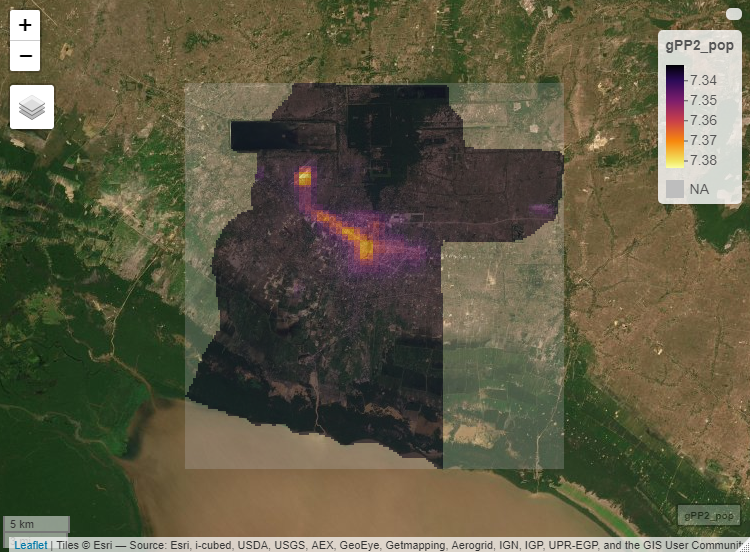

## Human Settlements, Roadways, and Healthcare facilities in Ratanakiri Province

I chose to investigate the human settlemetns, roadways, and healthcare facilities in Ratanakiri Province, one of the most impoverished provinces in Cambodia. This province was unique to me in the sense that this province borders Laos and Vietnam, and the Vietcong would regularly trek through the forests of this province to sneak into South Vietnam or deliver supplies. As a result, extensive bombing was done by the US to combat the Vietcong, which left this province in shambles, needing to rebuild itself after the war concluded. I chose Lumphat and Kuon Mom districts in Cambodia, with Lumphat on the right and Kuon Mom on the left. The total population of these two combined is 38731 people, with 23412 in Lumphat and 15319 in Kuon Mom. Lumphat has 12 polygons, or human settlement densities, while Kuon Mom has 4. Additional information on the two districts can be seen in the following table:
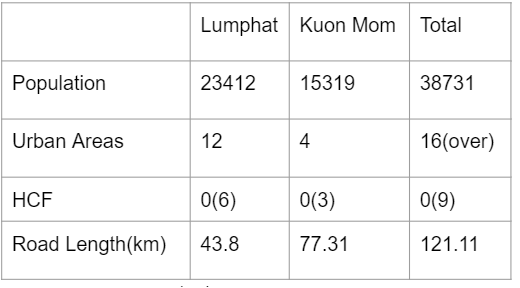

Roads, Healthcare Facilities, and Human Settlements:
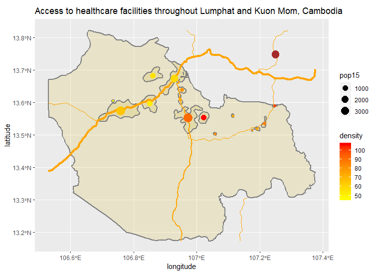

3d Visualization of Human Settlements:
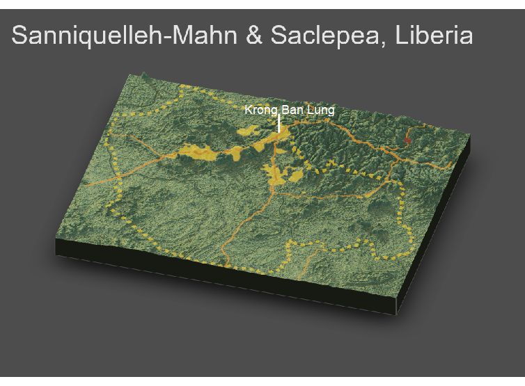

For Lumphat and Kuon Mom in Cambodia, it seems as if the general population densities seems to be rather closer to the areas with higher elavation. Especially in the Northeast region of these district, which seems to either have mountains or tall trees, but that’s where the District Capital resides actually, the Banlung District. Cambodians in this area seem to have their civilization around these tree dense, forest dense areas. The explanation for this could be the fact that the main income of these districts is tourism, and lots of their parks are centered around these nature resorts. 

The healthcare facilities location and relation with topography has been surprising, although my plot does not accurately reflect that. There are plenty of healthcare facilities in Lumphat and Kuon Mom, but HDX only has one single data point for a HCF, and that’s located deep in the forests / jungles. There has to be many more HCF, as it is needed to accommodate the foreigners coming for vacation. Thus, if I were to assume, it would be natural to say that the HCF would be along the roads and inside the tourism areas. Taking a look at Open Street Map, there are indeed many more Healthcare Facilities along the main roads and human settlements. Taking this into account however, access to healthcare facilities depends on the location one is to the main roads. If one has access to these main roads, say someone living in a tourist attraction place, then access is easy and simple. However, if one is living in the countryside, then the there is now a much harder chance of getting to a healthcare facilites as one has to travel many miles into urbanized areas. 

Take note that the number of polygons depicting human settlements is projected higher than normal. The reason for this was a river running through the polygons meant that they were not showing up in the final product. Thus, I had to lower contour levels to display them. The original, density heatmap map can be seen below, showcasing human settlements in the same higher but at a higher density and width. 

Lumphat:
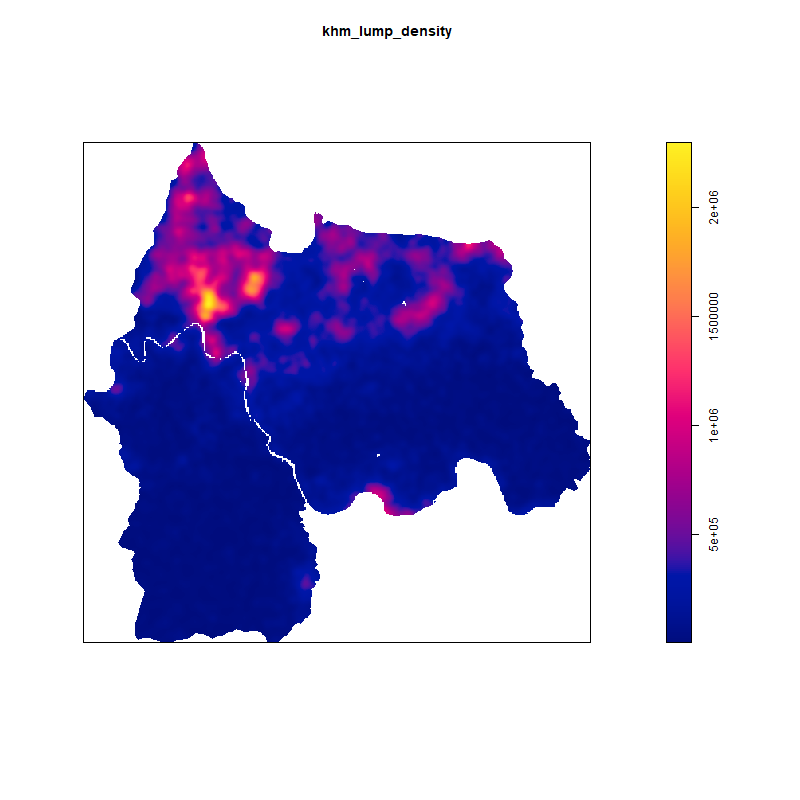

Kuon Mom:

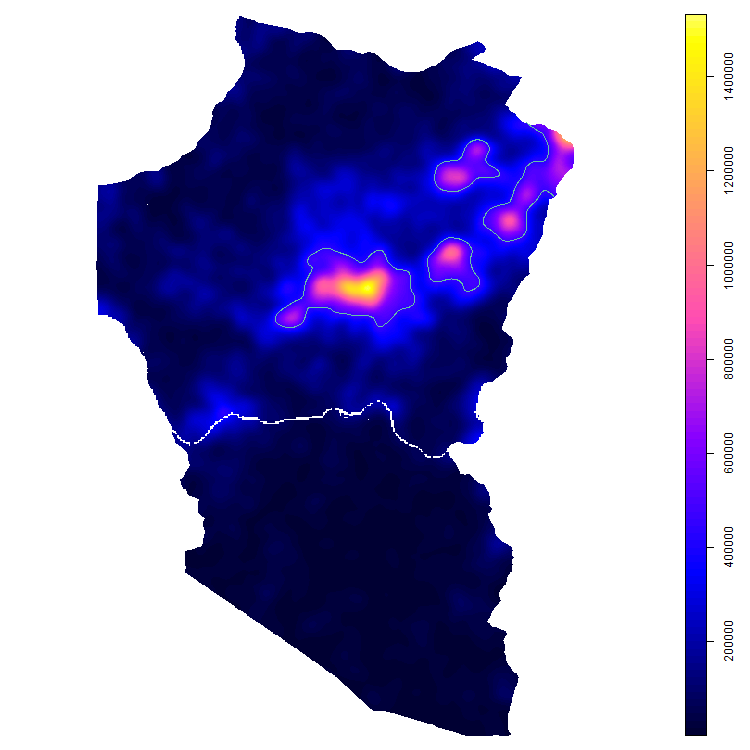

## State of Human Development Assessment

Cambodia is still much of a developing country, recovering from devastating events like the Vietnam War and the Khmer Rouge's regime. Much of the road system is in need of development, as aside from the main roads, there is a need of a better system of smaller roads that reach out to the farmers who are almost living in isolation. Any path they can take has to be an unpaved, dirt road through risky terrain. With this, improvements to access of healthcare is sure to follow, since there are plenty of healthcare facilities along the main roads and main human settlemetns and cities. The Cambodian government understands their issue with the roads, and have signed an agreement with China under their Belt and Road policy to assign Middleastern and Southeast Asian countries with road development. In conclusion, Cambodia is rapidly improving their roads and other infrastructures to better improve situations like the ones seen in Ratanakiri Province. 

  
